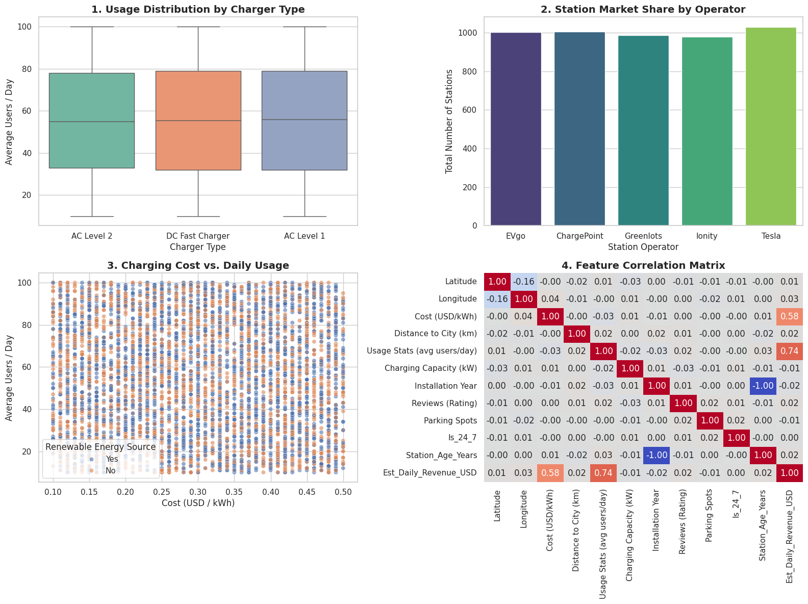

# ⚡ EV Charging Stations - Exploratory Data Analysis (EDA)

## 📌 Project Overview
This project performs an Exploratory Data Analysis (EDA) and Feature Engineering on a dataset of **5,000 EV charging stations** across 5 major operators (*Tesla, ChargePoint, EVgo, Greenlots, Ionity*). The goal is to extract business insights, evaluate operator market shares, and analyze revenue drivers.

---

## 📸 Dashboard & Visualizations Preview
<!-- Replace 'dashboard_preview.png' with your actual screenshot filename uploaded to this repository -->
<div align="center">
  
</div>

---

## 🛠️ Tech Stack & Tools
* **Language:** Python
* **Libraries:** Pandas, NumPy, Matplotlib, Seaborn
* **Environment:** Google Colab / Jupyter Notebook

---

## 🔑 Key Features & Highlights
- **Data Preprocessing:** Handled 5,000 rows and 17 features with 0 missing values and duplicate checks.
- **Feature Engineering:**
  - `Is_24_7`: Binary indicator for 24/7 station availability.
  - `Station_Age_Years`: Calculated station operational age.
  - `Est_Daily_Revenue_USD`: Estimated daily revenue using daily usage stats and cost per kWh.

---

## 📊 Key Findings & Business Insights
1. **Revenue Drivers:** Daily station usage and charging rates show a strong positive correlation ($+0.74$) with estimated revenue.
2. **Balanced Market Share:** All 5 operators hold an even market share (~20% / ~1,000 stations each).
3. **Charger Capacity:** Station utilization is consistent (~55 users/day average) across AC Level 1, AC Level 2, and DC Fast Chargers.

---

## 🚀 How to Run
1. Clone the repository:
   ```bash
   git clone [https://github.com/shubamsarkar99/ev-charging-stations-eda.git](https://github.com/shubamsarkar99/ev-charging-stations-eda.git)